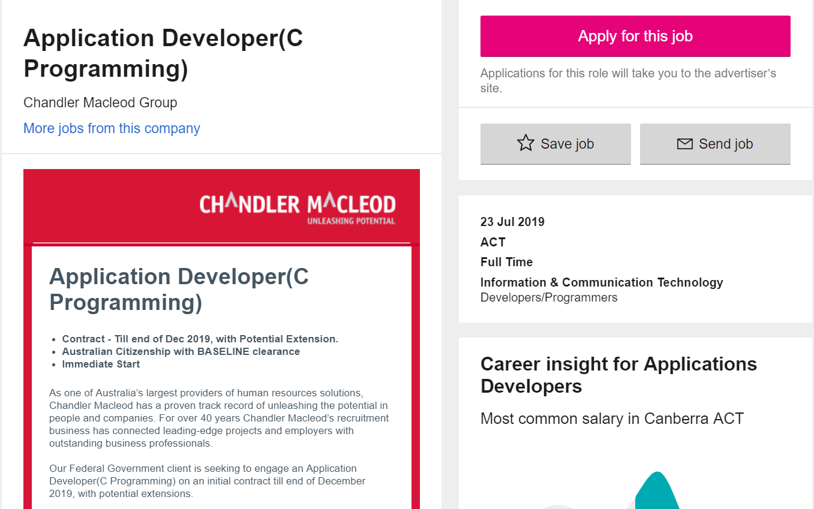

<h1>My Profile</h1>
COSC1078A1
Nuozehua Li
<h1>Welcome to my website!</h1>

<html>
  <head>
  <title> My assignment 1</title>
  </head>
<body>
  <h2>1.Personal Information</h2>
  
My name is Nuozehua Li, Jason is my English name. 
    My student number is S3701549, the email address is S3701549@student.rmit.edu.au.
    I come from JiangSu China, in my hometown, there are many famous scenic spot such as natural caves and bamboo forests.

    
    
    
I have been in Melbourne for a year, I graduated from diploma and start my bachelor life now. I can speak Chinese, English, but     my English still not very good.
    About my hobby, l like playing games in my free time. I also like listening music when I read books, it can make me relax.

<h2>2.Interest in IT</h2>

  <h3>● What is your interest in IT?</h3>
  
When I was young and I first time to touch the computer, l had been attracted, so I’m really interested in computer from that time. Games, and Social software really made me crazy. With my growth, I start to interested in how does it work, thats why I choose IT now, l really want to programming my own software in the future, it’s cool for me.

  <h3>● Why did you choose to come to RMIT? </h3>
  
I choose RMIT because there are have good environment, RMIT university is in downtown Melbourne and there are many Chinese students, if I have something don’t understand, it’s easy to ask them for help.   

  <h3>● What do you expect to learn during your studies?</h3>
  
I hope I can study enough knowledge of computer and computer communication, In particular programming skills, make sure l can find a good job in the future.

  
  
  <h2>3.Ideal Job</h2>
  
  <h3>● The job advertisement withlink, and a snapshot

  
Link: https://www.seek.com.au/job/39531693?searchrequesttoken=e34563fd-3f51-446a-b3f2-8dc9d6a30e21&type=standard 

  
   

<h3> ● A description (in your own words) of the position, and particularly what makes this position appealing to you.</h3>

The position of this job is developing application, such as application encryption, Build and test modules coded and so on. I like this job because I think programming is interesting, it’s a teamwork,also I can develop myself while l am doing this job.

<h3> ● A description (in your own words) of the skills, qualifications and experience required for the position. </h3>

Get this job need Strong programming skills. You should know different programming languages such as JAVA and C or C++ and use it proficiency. Understanding of encryption is also a important part of this job, if you can do that, you will be considered first.

<h3> ● A description (in your own words) of the skills, qualifications and experience you currently have.</h3>

I just a new learner to the programming, now l can only use some basic programming knowledge to do some easy work. I have no work experience and necessary qualifications.

 <h3> ● A plan describing how you will obtain the skills, qualifications and experience required for the position, building on those you have now.</h3>

For get this job, I should continue to study programming skills in the university, at least finish all bachelor courses about the programming, after that l will consider to be a graduate student to get a higher degree. Then I will find a Practical work to accumulate more work experience like understand how do the programming team working, working mode and content; As the same time, l will develop myself.

<h2>4.Personal Profile</h2>
<h3> ● The results of an online Myers-Briggs test.</h3>

</body>
</html>
